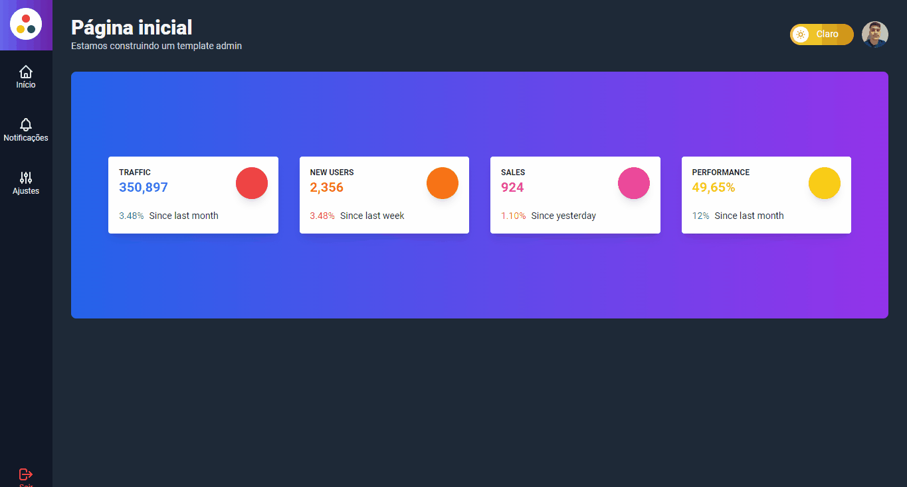

<p align="center">
  <a href="#-tecnologias">Tecnologias</a>&nbsp;&nbsp;&nbsp;|&nbsp;&nbsp;&nbsp;
  <a href="#-projeto">Projeto</a>&nbsp;&nbsp;&nbsp;|&nbsp;&nbsp;&nbsp;
  <a href="#-licença">Licença</a>&nbsp;&nbsp;&nbsp;|&nbsp;&nbsp;&nbsp;
  <a href="#-getting-started">Getting Started</a>
</p>

<p align="center">
 

  
</p>

<br>

<p align="center">
  
</p>

## 🚀 Tecnologias

Esse projeto foi desenvolvido com as seguintes tecnologias:

- ReactJS
- Next.js

Bibliotecas

- [Tailwind CSS](https://tailwindcss.com/)
- [Google Firebase](https://firebase.google.com/)
- [Google Fonts](https://fonts.google.com/)

## 💻 Projeto

Aplicação com intuito de fazer a administração de uma empresa, desenvolvida utilizando ReactJS e Next.js.

[x] Responsividade em dispositivos pequenos, médios e grandes.
[x] Desenvolvida seguindo o conceito Mobile First.
[x] Integração e autenticação com o Google Firebase.
[x] Dark mode e Light mode.
[x] Estilização com o Tailwind CSS.

Você pode visitar a aplicação [clicando aqui](/)

## 📝 Licença

Esse projeto está sob a licença MIT. Veja o arquivo [LICENSE](.github/LICENSE.md) para mais detalhes.

## ▶ Getting Started

Rode a aplicação no servidor de desenvolvimento:

```bash
npm run dev
# or
yarn dev
```

Abra [http://localhost:3000](http://localhost:3000) em seu navegador e veja o resultado.
